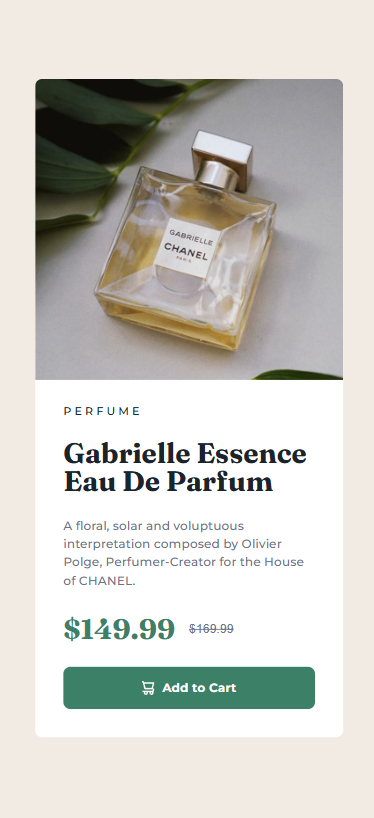

# Frontend Mentor - Product preview card component solution

This is a solution to the [Product preview card component challenge on Frontend Mentor](https://www.frontendmentor.io/challenges/product-preview-card-component-GO7UmttRfa). Frontend Mentor challenges help you improve your coding skills by building realistic projects.

## Table of contents

- [Frontend Mentor - Product preview card component solution](#frontend-mentor---product-preview-card-component-solution)
  - [Table of contents](#table-of-contents)
  - [Overview](#overview)
    - [The challenge](#the-challenge)
    - [Screenshot](#screenshot)
    - [Links](#links)
  - [My process](#my-process)
    - [Built with](#built-with)
    - [What I learned](#what-i-learned)
    - [Continued development](#continued-development)
    - [Useful resources](#useful-resources)
  - [Author](#author)

## Overview

### The challenge

Users should be able to:

- View the optimal layout depending on their device's screen size
- See hover and focus states for interactive elements

### Screenshot



### Links

- Solution URL: [Github URL](https://github.com/josetarjosetar/fio-2-preview-card-component)
- Live Site URL: [Live site URL](https://josetarjosetar.github.io/fio-2-preview-card-component/)

## My process

### Built with

- Semantic HTML5 markup
- Flexbox
- Mobile-first workflow

### What I learned

I learned how to set up CSS variables for design colors in one centralized place. I set them up in the :root pseudo-class so that they can be used throughout the project. It is the following snippet of code.

```css
:root {
  --color-cream: hsl(30, 38%, 92%);
  --color-white: hsl(0, 0%, 100%);
  --color-black: hsl(212, 21%, 14%);
  --color-grey: hsl(228, 12%, 48%);
  --color-green-500: hsl(158, 36%, 37%);
  --color-green-700: hsl(158, 42%, 18%);
}
```

I successfully created a decent replica of the design image without having access to the design files. I did that by estimating most of the gaps to be in the list of [2, 4, 8, 12, 16, 24, 32, 48] pixels.

I created my first responsive code so that one picture is displayed in the case the device of the user is mobile and another in case the user device is desktop. I did that with the following snippet:

```css
@media (min-width: 680px) {
  /*..some other code..*/

  .product-img {
    display: none;
  }

  .product-img-desktop {
    display: block;
    width: 50%;
    object-fit: cover;
  }
}
```

### Continued development

I'd like to continue improving in responsive design and building websites with complex layouts for both desktop and mobile devices.

### Useful resources

- [Github solution to another challenge](https://github.com/Antonio-Rafael-Silva/projeto-qr-component) - This helped me when defining CSS variables for the project on how I should define them.
- [Youtube video by Kevin Powell on another challenge](https://www.youtube.com/watch?v=h4dHvo09cG4&list=PL4-IK0AVhVjPv5tfS82UF_iQgFp4Bl998&index=19) - This gave me confidence that I can build a similar site by using only a jpg image design.
- [StackOverflow solution to multiple images for responsiveness](https://stackoverflow.com/questions/27853884/media-queries-and-image-swapping) - On this site I found how I could use multiple images for a responsive screen on both mobile and desktop

## Author

- Frontend Mentor - [@josetarjosetar](https://www.frontendmentor.io/profile/josetarjosetar)
